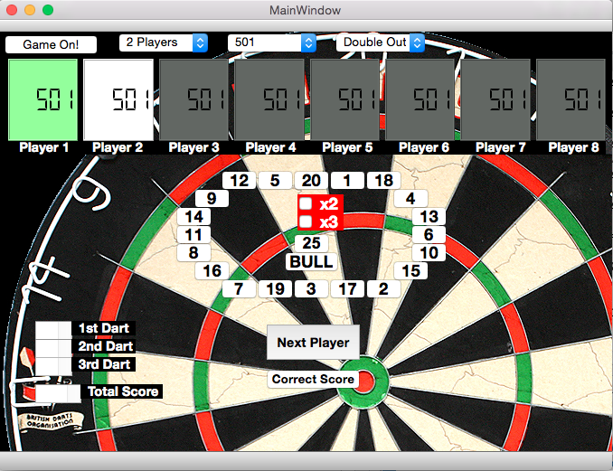

# DartsCalc-qt5
This was a first test program using QT5. Up to 8 player with sound output (some audio files of **Russ Bray** included :) ).

This is just a simple darts calculator...no statistics and no automatic recognition.

If no audio file for the thrown score is found, Google Translate speech output is used.

